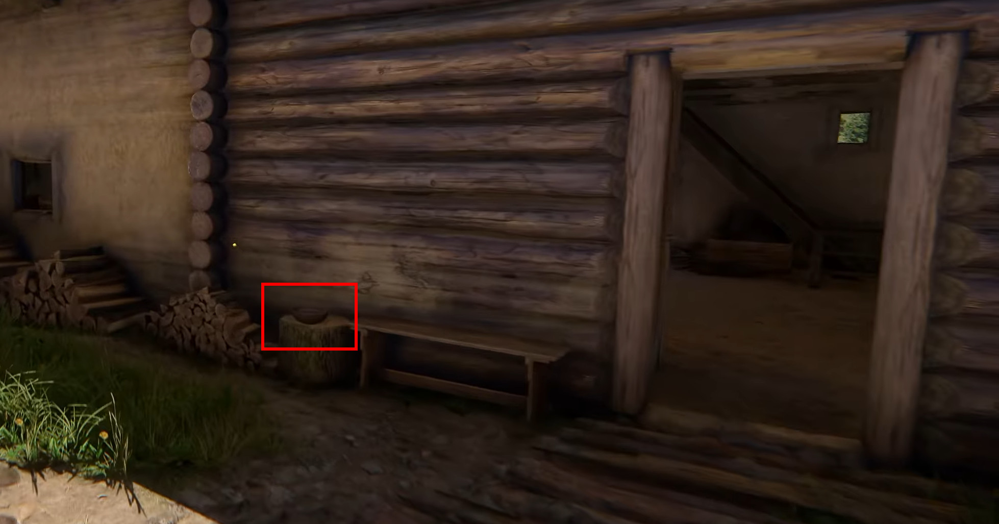
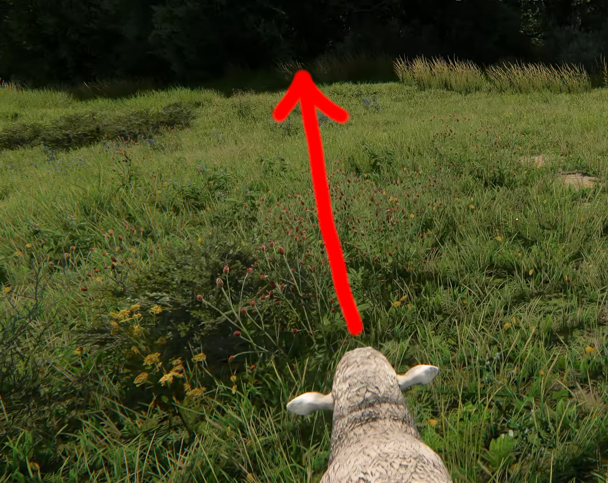

## 젤레요프 마을 올브람 영감과 대화

젤레요프를 찾아가서 **올브람** 영감과 대화를 통해 임무가 발생합니다.

* 타호프 사람들과 무슨 문제라도 있습니까?
* 기꺼이 돕겠습니다.
* 알겠습니다. 제가 축제 기둥을 가져오죠.

##  타호프 여관주인 프로셰크와 대화

타호프를 찾아가서 여관주인 **프로셰크**와 대화를 합니다.

* 축제 기둥이 아주 멋지군요.
* (매력 판정)저는 좋은 축제 기둥은 딱 알아봅니다.
* 헤닉에 관해.
* 네, 제가 하죠.
* (대화를 끝낸다)

## 헤닉을 혼줄내주던가 데이트 주선하기
축제 기둥을 가져오려면, **헤닉**을 어떻게든 쫓아내야 합니다. 지도에 헤닉의 위치가 표시됩니다.

헤닉과 대화에서 데이트를 주선해 주려면 아래와 같이 대화를 하면 됩니다. 

* 좀 어때?
* (설득 판정)왜 그래?
* 맞아, 봤어.
* 내가 네 일을 맡아줄게. 둘이 놀러 나가.

만약 혼줄을 내주고 싶다면 아래와 같이 대화를 하면 됩니다.

* 네 형들은 어때?
* 넌 언제 떠날 건데?

## 헤닉과 만카의 데이트를 주선
데이트를 주선해주기 위해 타호프 여관 주변에 **만카**와 대화를 합니다.

* 헤닉이랑 네 얘기를 했어.
* 만카도 널 만나고 싶대.

## 축제 기둥 훔치기
축제 기둥을 훔치기 전에 **도끼**를 하나 챙겨둬야 합니다. 아무 도끼나 하나 라도반에게 구매를 하던, 직접 제작을 하나 하던 도끼를 마련합니다.

시간 **22:00** 이후, 축제 기둥을 감시중인 헤닉을 찾아가서 대화를 합니다.

* 가서 만카를 만나.

헤닉이 만카를 만나러 떠나고, 기둥에 상호작용을 해서 축제 기둥을 훔칩니다.

## 올브람 영감에게 보고
올브람 영감에게 보고하면 보상을 받습니다.

올브람 영감은 여기서 만족 못하고, 다른 부탁을 해 옵니다. 타호프 사람들을 골탕 먹이기 위해 대화를 합니다.

## 알쉬크 소화 불량 일으키기
올브람 영감과 대화 후 **알쉬크에게 줄 설사약**을 받습니다.

아침 **8시 이후**에 타호프 여관 뒤쪽에 **밥그릇**에 설서약을 넣어야 합니다. 아무도 안 볼 때 해야 문제가 발생하지 않습니다. 숨어서 밥그릇에 **알쉬크의 간식을 더 좋게 만든다.**라는 상호작용을 해 줍니다.

낮 12시 이후 알쉬크가 밥을 먹기 위해 밥그릇을 가지러 옵니다. 자신의 목장으로 가서 밥을 먹는데, 잠시 후 배가 아프다며 뛰어갑니다.

## 양을 몰아서 빨래 더럽히기
빨래를 지키는 **여인**이 존재할 수 있습니다. 만약 그렇다면 1~2시간 정도 시간을 보내면 여인이 사라집니다. 양을 뒤에서 몰아서 지도에 위치한 **빨래 4곳**을 더럽히면 됩니다.

## 양을 목초지에서 몰아내기
6마리의 양을 몰아서 목초지에서 몰아내야 합니다.

## 올브람 영감에게 보고

* 양 떼 일을 처리했습니다.

보고를 하면 그로센 보상을 받습니다. 이후 대화를 이어갑니다.

* 그 원대한 계획의 다음 단계는 뭡니까?
* 그러죠.
* 화해하는 게 낫지 않습니까?
* 먼저 이 문제를 해결해 보겠습니다.

그럼 보조 임무 **개구리와 쥐의 싸움**이 발생합니다.

여기까지 개구리 공략을 마치겠습니다.
