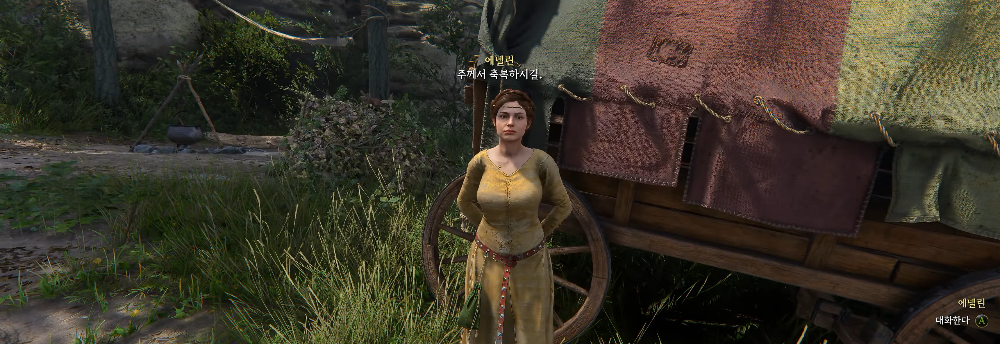

## 젤레요프 목욕탕 주인 도로시와 대화
크레이즐의 도움을 받아 결혼식에 참석하려면, 동행할 여자를 찾아야 합니다.

크레이즐은 젤레요프의 목욕탕에서 하녀를 구하라고 합니다.

목욕탕 주인 도로시와 대화에서 아무거나 선택해서 진행을 합니다.

* 크레이즐이 제안을 하고 싶답니다.

그럼 도로시는 유목민 야영지에 있는 **에넬린**을 추천해 줍니다.

## 유목민 야영지의 에넬린과 대화

유목민 야영지에게 수소문을 하면 **에넬린**을 찾을 수 있습니다.

* 당신이 에넬린인가?
* 발보다 소문이 빠른 법이지.(평판 상승)
* 암소 두 마리는 살 정도지.
* 만찬을 즐길 수 있어.
* 말을 구경할 수 있어.
* 폰 베르고프 경이 올 거야.
* 그 사람과…친해졌으면 해.(뭘 선택해도 평판 하락)
* 미안해.(평판 상승)
* 트로스키에 있는 책 때문이야.
* 목욕탕에서 집사에 관해 물어봤었어.
* 그럼 합의된 건가?
* 내가 와인을 좀 찾아주지.(평판 상승)

**향수와 드레스, 와인**을 구해서 에넬린에게 전달해야 합니다.

## 민타 향수 구하기
직접 **민타 향수**를 제조해도 되고, 약초 상인에게서 구매해도 됩니다.

## 드레스 구하기
트로스코비츠의 제단사 **바르토셰크**에게서 티롤 양단 코트아르디를 구매하거나 훔칩니다.

## 와인 구하기
와인은 여관 주인이 판매하니 아무 여관 주인에게서 구매를 합니다.

## 에넬린에게 모두 전달
에넬린에게 필요한 물건을 모두 전달하면, 주인공도 결혼식에 참석하기 위해서 매력이 높은 의상을 입고 오라고 합니다.

에넬린에게서 합격을 받기 위해서는 최소 **매력 16**을 맞춰야 합니다. 제단사에게서 매력이 높은 옷을 구매하거나, DLC 특전 옷을 입어도 됩니다. 다만, 방어구는 해당되지 않습니다.

## 결혼식 참석

* 이제 결혼식을 보러 가자.

에넬린에게 대화를 하면 결혼식에 참석하게 되며 컷신이 발생합니다.

## 주요 임무
여기까지 진행하면, 보조 임무 걸작이 잠시 중단되고, 주요 임무 결혼식 훼방꾼이 진행됩니다.

이후 연결되어  주요 임무 누구를 위하여 종은 울리나까지 완료해야 걸작 임무를 다시 이어서 할 수 있습니다.

## 트로스키 성의 서기관 에라짐과 대화
**누구를 위하여 종은 울리나** 임무 이후 트로스키 성을 마음대로 돌아다닐 수 있습니다.

트로스키 성의 남서쪽에 위치한 서기관 에라짐과 대화를 합니다.

* 책 한 권을 빌리고 싶은데요.
* 흥미로운 지혜가 적혀있다고 들었기 때문입니다.
* 무슨 일이 있었던 걸까요?
* 멍청한 이들은 책을 읽어선 안 됩니다!(평판 상승)
* 귀족을 피해 다니시는 건가요?
* 제가 책을 찾아오겠습니다.(평판 상승)

그럼 서기관은 베르타, 레지나, 헤르시 3명의 위치를 알려줍니다.

## 요리사 베르타와 대화

* 니크바르트 경에 관해
* 그 다음엔 어디로 가셨습니까?
* 제 말을 들으세요.
* (설득 판정)저 역시 비밀을 소중히 지킬 겁니다.(평판 상승)

## 하녀 레지나와 대화

* 읽어드리겠습니다.
* 알겠습니다.

## 일꾼 헤르시와 대화
헤르시는 **롱소드**를 구해 오라고 합니다. 아무 롱소드를 주면 되는데, 굳이 좋은 롱소드를 줄 필요는 없습니다.

위 지도에 표시된 곳에 **연습용 롱소드**가 있습니다. 그걸 가져다주면 정보를 줍니다.

## 책 찾기

토로스키 성을 나가서 위 지도에 표시된 위치에 **니크바르트 경의 시신**과 빛의 인도자의 비밀책이 있습니다.

## 방앗간지기 크레이즐에게 보고

* 이제 뭘 하죠?

보고를 하면 보니가 있는 **소굴**로 가자고 합니다.

소굴에 도착하면 컷신이 발생하며 임무가 완료됩니다.

여기까지 걸작 공략을 마치겠습니다.
